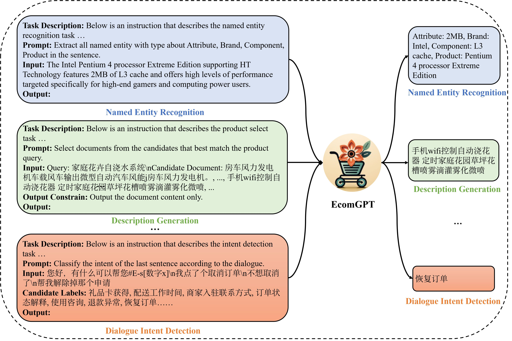
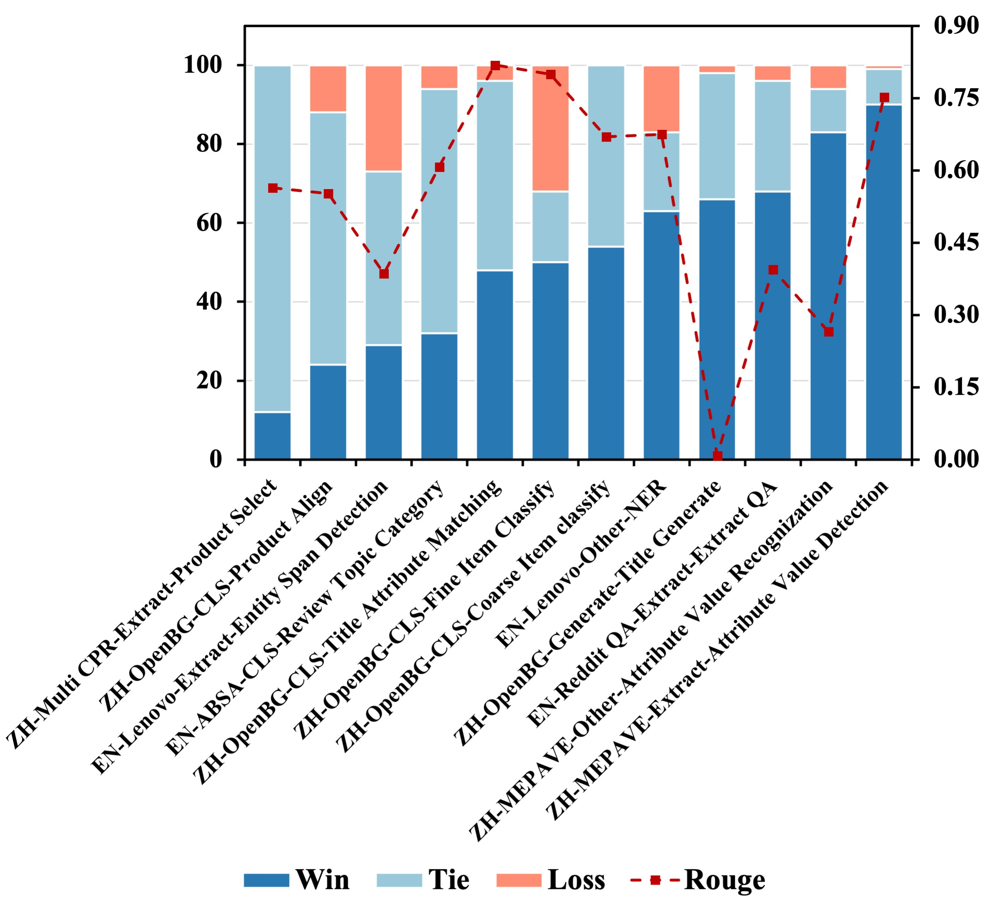

<div align="center">

</div>

# An Instruction-Following Large Language Model For E-commerce

[](https://pytorch.org/)[](https://arxiv.org/pdf/2308.06966.pdf)

Repo for [*EcomGPT: Instruction-tuning Large Language Models with Chain-of-Task Tasks for E-commerce*](https://arxiv.org/pdf/2308.06966)

- **we proposed the first E-commerce instruction dataset EcomInstruct, with a total of 2.5 million instruction data**.
- EcomInstruct scales up the data size and task diversity by constructing **atomic tasks with E-commerce basic data types**, such as product information, user reviews. Atomic tasks are defined as intermediate tasks implicitly involved in solving a final task, which we also call Chain-of-Task tasks. 
- We developed EcomGPT by training the backbone model BLOOMZ with the EcomInstruct. **Benefiting from the fundamental semantic understanding capabilities acquired from the Chain-of-Task tasks, EcomGPT exhibits excellent zero-shot generalization capabilities.**

<div align="center">
    
</div>

## Perfomance

We perform a human evaluation on EcomGPT and ChatGPT using 12 E-commerce held-out datasets. EcomGPT outperforms or tied ChatGPT on 12 datasets.

<div align="center">

</div>

## Dependencies
```bash
pip install -r requirement.txt
```
#### Details
- Python (>= 3.7)
- [PyTorch](http://pytorch.org/) (>= 2.0.0)
- numpy
- [Transformers](http://huggingface.co/transformers/) (>= 4.27.4)
- seqeval
- rouge


## Model
The EcomGPT (7b1) will be available at [*ModelScope*](https://github.com/modelscope). 

## Dataset (EcomInstruct)

We first open source 12 evaluation datasets. To ensure evaluation efficiency, each evaluation dataset is sampled with only 500 instances.

| Dataset   | Lang. | Task                          | Metric    |
| :-------- | :---- | :---------------------------- | :-------- |
| Lenove    | EN    | Named Entity Recognization    | F1, Rouge |
| Lenove    | EN    | Entity Span Detection         | Rouge     |
| Reddit    | EN    | Extractive QA                 | Rouge     |
| ABSA      | EN    | Review Topic Classification   | F1, Rouge |
| MEPAVE    | ZH    | Attribute Value Recognization | F1, Rouge |
| MEPAVE    | ZH    | Attribute Value Detection     | Rouge     |
| Multi-CPR | ZH    | Product Select                | Rouge     |
| Multi-CPR | ZH    | Product Align                 | F1, Rouge |
| OpenBG    | ZH    | Title Attritube Matching      | F1, Rouge |
| OpenBG    | ZH    | Fine-grain Product Classify   | F1, Rouge |
| OpenBG    | ZH    | Coarse-grain Product Classify | F1, Rouge |
| OpenBG    | ZH    | Title Generate                | Rouge     |

The dataset files **satisfy the following file hierarchy**:

```
.
├── [Dataset Name]
│   └── tasks
│       └── [task name]
│           ├── meta-info.json
│           └── test.json
...
└── Reddit_QA
    └── tasks
        └── EN-Reddit_QA-Extract-Extract_QA
            ├── meta-info.json
            └── test.json
```

## Evaluation

One can evaluate the performance of EcomGPT with the following command：

```bash
python eval.py -tf ./test_tasks.txt -m [model name or path] -sn [result file name] -bdd [base dataset dir]
```

## TODO

- Open Source Weight of EcomGPT

## Citation

If you found this work useful, consider giving this repository a star and citing our paper as followed:

```bigquery
@article{li2023ecomgpt,
  title={EcomGPT: Instruction-tuning Large Language Models with Chain-of-Task Tasks for E-commerce},
  author={Li, Yangning and Ma, Shirong and Wang, Xiaobin and Huang, Shen and Jiang, Chengyue and Zheng, Hai-Tao and Xie, Pengjun and Huang, Fei and Jiang, Yong},
  journal={arXiv preprint arXiv:2308.06966},
  year={2023}
}
```
